2017 Biostatistics assignment memorandum
================
Peter Kamerman

Assignment 1
============

Hello Octocat
-------------

I love Octocat. She’s the coolest cat in town.


------------------------------------------------------------------------

Assignment 2
============

``` r
# 'Promise' the anscombe dataset (not essential)
data('anscombe')

# Dimensions
dim(anscombe)
```

    ## [1] 11  8

``` r
# Column names
names(anscombe)
```

    ## [1] "x1" "x2" "x3" "x4" "y1" "y2" "y3" "y4"

``` r
# top-and-tail (default is 6 lines)
head(anscombe)
```

    ##   x1 x2 x3 x4   y1   y2    y3   y4
    ## 1 10 10 10  8 8.04 9.14  7.46 6.58
    ## 2  8  8  8  8 6.95 8.14  6.77 5.76
    ## 3 13 13 13  8 7.58 8.74 12.74 7.71
    ## 4  9  9  9  8 8.81 8.77  7.11 8.84
    ## 5 11 11 11  8 8.33 9.26  7.81 8.47
    ## 6 14 14 14  8 9.96 8.10  8.84 7.04

``` r
tail(anscombe)
```

    ##    x1 x2 x3 x4    y1   y2   y3    y4
    ## 6  14 14 14  8  9.96 8.10 8.84  7.04
    ## 7   6  6  6  8  7.24 6.13 6.08  5.25
    ## 8   4  4  4 19  4.26 3.10 5.39 12.50
    ## 9  12 12 12  8 10.84 9.13 8.15  5.56
    ## 10  7  7  7  8  4.82 7.26 6.42  7.91
    ## 11  5  5  5  8  5.68 4.74 5.73  6.89

``` r
# Summary stats
summary(anscombe)
```

    ##        x1             x2             x3             x4    
    ##  Min.   : 4.0   Min.   : 4.0   Min.   : 4.0   Min.   : 8  
    ##  1st Qu.: 6.5   1st Qu.: 6.5   1st Qu.: 6.5   1st Qu.: 8  
    ##  Median : 9.0   Median : 9.0   Median : 9.0   Median : 8  
    ##  Mean   : 9.0   Mean   : 9.0   Mean   : 9.0   Mean   : 9  
    ##  3rd Qu.:11.5   3rd Qu.:11.5   3rd Qu.:11.5   3rd Qu.: 8  
    ##  Max.   :14.0   Max.   :14.0   Max.   :14.0   Max.   :19  
    ##        y1               y2              y3              y4        
    ##  Min.   : 4.260   Min.   :3.100   Min.   : 5.39   Min.   : 5.250  
    ##  1st Qu.: 6.315   1st Qu.:6.695   1st Qu.: 6.25   1st Qu.: 6.170  
    ##  Median : 7.580   Median :8.140   Median : 7.11   Median : 7.040  
    ##  Mean   : 7.501   Mean   :7.501   Mean   : 7.50   Mean   : 7.501  
    ##  3rd Qu.: 8.570   3rd Qu.:8.950   3rd Qu.: 7.98   3rd Qu.: 8.190  
    ##  Max.   :10.840   Max.   :9.260   Max.   :12.74   Max.   :12.500

------------------------------------------------------------------------

Assignment 3
============

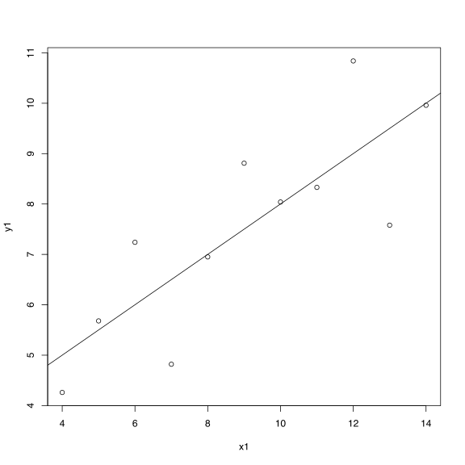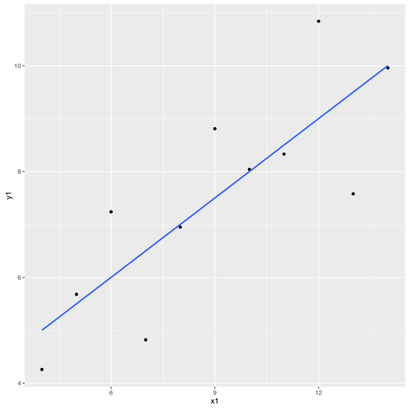

------------------------------------------------------------------------

Assignment 4
============

Chick weights
-------------

### Import data

``` r
# Read directly from URL 
## Only using one 'readr' function so using 'readr::' method to call function
data <- readr::read_csv('https://dl.dropboxusercontent.com/u/11805474/painblogr/biostats/assignments/analgesic.csv')
```

### Quick look

``` r
# Dimensions
dim(data)
```

    ## [1] 40  5

``` r
# Column names
names(data)
```

    ## [1] "ID"            "Group"         "Measurement_1" "Measurement_2"
    ## [5] "Measurement_3"

``` r
# Top-and-tail
head(data)
```

    ## # A tibble: 6 x 5
    ##      ID     Group Measurement_1 Measurement_2 Measurement_3
    ##   <int>     <chr>         <int>         <int>         <int>
    ## 1     1 Analgesic            26            26            21
    ## 2     2 Analgesic            29            26            23
    ## 3     3 Analgesic            24            28            22
    ## 4     4 Analgesic            25            22            24
    ## 5     5 Analgesic            24            28            23
    ## 6     6 Analgesic            22            23            26

``` r
tail(data)
```

    ## # A tibble: 6 x 5
    ##      ID   Group Measurement_1 Measurement_2 Measurement_3
    ##   <int>   <chr>         <int>         <int>         <int>
    ## 1    35 Placebo            17            21            15
    ## 2    36 Placebo            19            17            15
    ## 3    37 Placebo            14            19            13
    ## 4    38 Placebo            17            19            13
    ## 5    39 Placebo            11            20            18
    ## 6    40 Placebo            15            18            12

``` r
# Summary stats
summary(data)
```

    ##        ID           Group           Measurement_1   Measurement_2 
    ##  Min.   : 1.00   Length:40          Min.   :10.00   Min.   : 8.0  
    ##  1st Qu.:10.75   Class :character   1st Qu.:17.00   1st Qu.:17.0  
    ##  Median :20.50   Mode  :character   Median :20.00   Median :20.0  
    ##  Mean   :20.50                      Mean   :20.12   Mean   :20.7  
    ##  3rd Qu.:30.25                      3rd Qu.:24.00   3rd Qu.:25.0  
    ##  Max.   :40.00                      Max.   :30.00   Max.   :32.0  
    ##  Measurement_3  
    ##  Min.   :12.00  
    ##  1st Qu.:16.00  
    ##  Median :20.50  
    ##  Mean   :20.52  
    ##  3rd Qu.:24.25  
    ##  Max.   :30.00

### Clean data

``` r
# Load packages
library(dplyr)
library(tidyr)

data_tidy <- data %>%
    # Gather measurement columns
    ## Using 'starts_with' function to select columns
    gather(key = Measurement, value = value, starts_with('Meas')) %>%
    ## Some alternative gather options
    ### gather(key = Measurement, value = value, 3:5) %>%
    ### gather(key = Measurement, value = value, Measurement_1, Measurement_2, Measurement_3) %>%
    ### gather(key = Measurement, value = value, -ID, -Group) %>%
    # Summarise columns
    ## First group the data. First by intervention, then by subject ID
    group_by(Group, ID) %>%
    ## Then summarise
    summarise(mean = mean(value))

# Quick look
data_tidy
```

    ## # A tibble: 40 x 3
    ## # Groups:   Group [?]
    ##        Group    ID     mean
    ##        <chr> <int>    <dbl>
    ##  1 Analgesic     1 24.33333
    ##  2 Analgesic     2 26.00000
    ##  3 Analgesic     3 24.66667
    ##  4 Analgesic     4 23.66667
    ##  5 Analgesic     5 25.00000
    ##  6 Analgesic     6 23.66667
    ##  7 Analgesic     7 26.66667
    ##  8 Analgesic     8 23.33333
    ##  9 Analgesic     9 22.66667
    ## 10 Analgesic    10 24.00000
    ## # ... with 30 more rows

------------------------------------------------------------------------

Assignment 5
============

Chicken weights
---------------

**Null hypothesis:** Feed type does not influence the growth rate of hatchlings

**Alternative hypothesis:** Feed type influences growth rate of hatchlings

``` r
# Load packages
###############
library(readr)
#library(dplyr)
#library(tidyr)
#library(ggplot2)

# Import data
#############
data <- read_csv('https://dl.dropboxusercontent.com/u/11805474/painblogr/biostats/assignments/chick-weights.csv?dl=1')

# Quick look
############
data
```

    ## # A tibble: 71 x 2
    ##    weight      feed
    ##     <int>     <chr>
    ##  1    179 horsebean
    ##  2    160 horsebean
    ##  3    136 horsebean
    ##  4    227 horsebean
    ##  5    217 horsebean
    ##  6    168 horsebean
    ##  7    108 horsebean
    ##  8    124 horsebean
    ##  9    143 horsebean
    ## 10    140 horsebean
    ## # ... with 61 more rows

``` r
# Tidy data
###########
## Data already in tidy (long) format

# Plot data
###########
## Base graphics
with(data, boxplot(weight ~ feed))
```

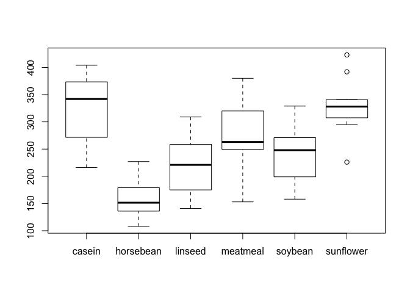

``` r
## ggplot
ggplot(data = data, aes(x = feed, y = weight)) + # data and aesthetic mapping
    geom_boxplot() # boxplot geom
```

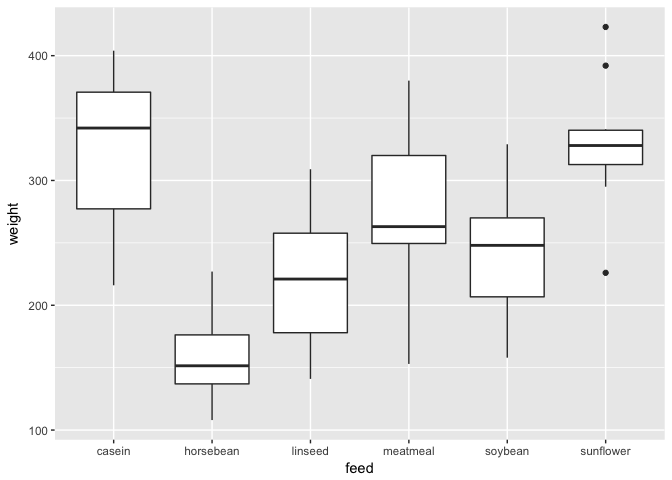

``` r
# Looks like there may be a differerence betwen groups (horsebean = worst)

# Analysis
##########
## Will assume growth rate is normally distributed, therefore analyse using
## 1-way ANOVA for unmatched pairs. If you chose to use a non-parametric test, 
## The equivalent omnibus test would be 'kruskal.test(...)', and the post-hoc 
## tests would use 'pairwise.wilcox.test(...)'.

## Parametric test, therefore the following assumption need to be met:
# - The distribution of the data in the population is Gaussian
# - Equal variance across groups
# - The errors are independent
# - Data are unmatched

# Anova
summary(aov(weight ~ feed, data = data))
```

    ##             Df Sum Sq Mean Sq F value   Pr(>F)    
    ## feed         5 231129   46226   15.37 5.94e-10 ***
    ## Residuals   65 195556    3009                     
    ## ---
    ## Signif. codes:  0 '***' 0.001 '**' 0.01 '*' 0.05 '.' 0.1 ' ' 1

``` r
## Significant main effect: F(5, 65) = 15.37, p < 0.01
## Reject H0 and accept H1. That is, the feed type influences growth rate 
## of hatchlings. 

# Perform post-poc tests to detect where differences lie
with(data, pairwise.t.test(x = weight, 
                           g = feed, 
                           p.adjust.method = 'holm',
                           paired = FALSE)) # I'll leave you to intepret the output
```

    ## 
    ##  Pairwise comparisons using t tests with pooled SD 
    ## 
    ## data:  weight and feed 
    ## 
    ##           casein  horsebean linseed meatmeal soybean
    ## horsebean 2.9e-08 -         -       -        -      
    ## linseed   0.00016 0.09435   -       -        -      
    ## meatmeal  0.18227 9.0e-05   0.09435 -        -      
    ## soybean   0.00532 0.00298   0.51766 0.51766  -      
    ## sunflower 0.81249 1.2e-08   8.1e-05 0.13218  0.00298
    ## 
    ## P value adjustment method: holm

``` r
# CI interpretation
data %>%
    filter(feed == 'casein' | feed == 'horsebean') %>%
    t.test(weight ~ feed, data = .) %>%
    .$conf.int
```

    ## [1] 116.6982 210.0685
    ## attr(,"conf.level")
    ## [1] 0.95

``` r
#...repeat for all pairs and interpret the post-hoc tests in the context of 
# the magnitide of the differences in means. 
```

Drinking water
--------------

**Null hypothesis:** There is no association between number of glasses of drinking water consumed and contracting gastoenteritis.

**Alternative hypothesis:** The risk of gastroenteritis increases with increasing amount of water consumed.

``` r
# Load packages
###############
#library(readr)
#library(dplyr)
#library(tidyr)
#library(ggplot2)

# Import data
#############
data <- read_csv('https://dl.dropboxusercontent.com/u/11805474/painblogr/biostats/assignments/gastroenteritis.csv')

# Quick look
############
data
```

    ## # A tibble: 1,094 x 2
    ##        Consumption Outcome
    ##              <chr>   <chr>
    ##  1 < 1 glasses/day     ill
    ##  2 < 1 glasses/day     ill
    ##  3 < 1 glasses/day     ill
    ##  4 < 1 glasses/day     ill
    ##  5 < 1 glasses/day     ill
    ##  6 < 1 glasses/day     ill
    ##  7 < 1 glasses/day     ill
    ##  8 < 1 glasses/day     ill
    ##  9 < 1 glasses/day     ill
    ## 10 < 1 glasses/day     ill
    ## # ... with 1,084 more rows

``` r
# Tidy data
###########
# Tabulate data
data_x <- xtabs(~ Outcome + Consumption, data = data)

# Plot data
###########
## Base graphics - raw numbers
mosaicplot(data_x)
```


``` r
## Base graphics - proportions (down rows)
mosaicplot(prop.table(data_x, 1))
```


``` r
# Analysis
##########
## Ordinal data


## The following assumption need to be met:
# - Random sampling
# - Observations are independent (unpaired)
# - Observations follow the same distribution

# CMH test for ordinal data
library(vcdExtra)
CMHtest(data_x, types = c('cmeans'))
```

    ## Cochran-Mantel-Haenszel Statistics for Outcome by Consumption 
    ## 
    ##                 AltHypothesis  Chisq Df       Prob
    ## cmeans Col mean scores differ 74.857  2 5.5599e-17

``` r
# X^2 = 74.9, df = 2, n = 1094, p < 0.01  
# Reject H0 and accept H1. That is, the risk of gastroenteritis increases with
# increasing amount of water consumed.
```

Nausea
------

**Null hypothesis:** The 5HT receptor block does not affect nausea symptoms.

**Alternative hypothesis:** The 5HT receptor blocker reduces nausea symptoms.

``` r
# Load packages
###############
#library(readr)
#library(dplyr)
#library(tidyr)
#library(ggplot2)

# Import data
#############
data <- read_csv('https://dl.dropboxusercontent.com/u/11805474/painblogr/biostats/assignments/nausea.csv')

# Quick look
############
data
```

    ## # A tibble: 8 x 3
    ##   Patient Nausea_before Nausea_after
    ##     <int>         <int>        <int>
    ## 1       1             3            2
    ## 2       2             4            0
    ## 3       3             6            1
    ## 4       4             2            3
    ## 5       5             2            1
    ## 6       6             4            1
    ## 7       7             5            0
    ## 8       8             6           40

``` r
# Remove patient 8's data. Funny number in Nausea_after column. Without original
# records, we cannot confirm whether this is just a case of adduing a zero after 
# a score of '4', or a complete transcriuption error.
data <- data[-8, ]

# Tidy data
###########
# Gather and change Patient column class
data_tidy <- data %>%
    mutate(Patient = factor(Patient)) %>%
    gather(key = key, value = value, -Patient) %>%
    arrange(Patient)

# Plot data
###########
## Base graphics 
with(data_tidy, boxplot(value ~ key))
```

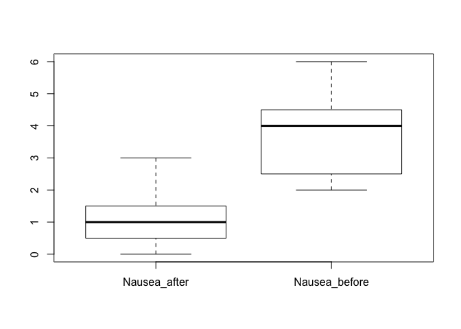

``` r
## ggplot
ggplot(data = data_tidy, aes(x = key, y = value)) +
    geom_boxplot()
```

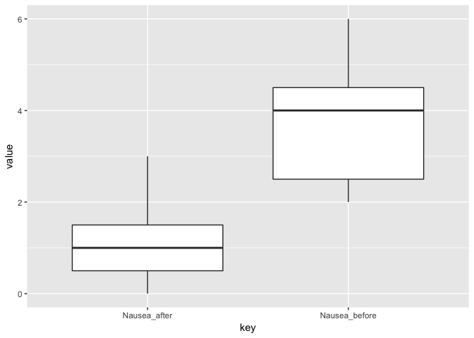

``` r
# Because of the discrete nature of the rating scale and some extreme values,
# analyse using non-parametric, paired two-way test: Wilcoxon signed rank test
# Test assumptions:
# - The errors are independent
# - Matching is effective
# - Samples are drawn from populations with the same shape distributions.

# Analysis
##########
wilcox.test(value ~ key, paired = TRUE, data = data_tidy)
```

    ## 
    ##  Wilcoxon signed rank test with continuity correction
    ## 
    ## data:  value by key
    ## V = 2, p-value = 0.04983
    ## alternative hypothesis: true location shift is not equal to 0

``` r
# wilcox.test(data$Nausea_before, data$Nausea_after, paired = TRUE)

# V = 2, p = 0.05
# No reason to reject H0. That is, the drug did not affect nausea symptoms
```

------------------------------------------------------------------------

Assignment 6
============

**Null hypothesis:** There is no linear relationship between housing prices and interest rates in the US.

**Alternative hypothesis:** There is a negative (inverse) relationship between housing prices and interest rates in the US.

``` r
# Load packages
###############
#library(readr)
#library(dplyr)
#library(tidyr)
#library(ggplot2)

# Import data
#############
data <- read_csv('https://dl.dropboxusercontent.com/u/11805474/painblogr/biostats/assignments/housing-prices.csv')

# Quick look
############
data
```

    ## # A tibble: 17 x 2
    ##    interest_rate median_house_price_USD
    ##            <int>                  <int>
    ##  1            10                 183800
    ##  2            10                 183200
    ##  3            10                 174900
    ##  4             9                 173500
    ##  5             8                 172900
    ##  6             7                 173200
    ##  7             8                 173200
    ##  8             8                 169700
    ##  9             8                 174500
    ## 10             8                 177900
    ## 11             7                 188100
    ## 12             7                 203200
    ## 13             8                 230200
    ## 14             7                 258200
    ## 15             7                 309800
    ## 16             6                 329800
    ## 17            NA                     NA

``` r
# Tidy data
###########
# Remove row of NAs
data <- data[complete.cases(data), ]

# Plot
######
# Base graphics
with(data, plot(x = interest_rate, y = median_house_price_USD))
```

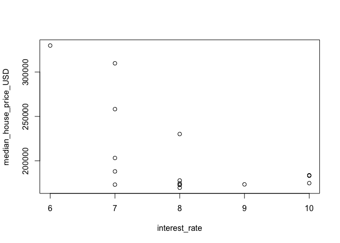

``` r
# ggplot
ggplot(data = data, aes(x = interest_rate, y = median_house_price_USD)) +
    geom_point()
```

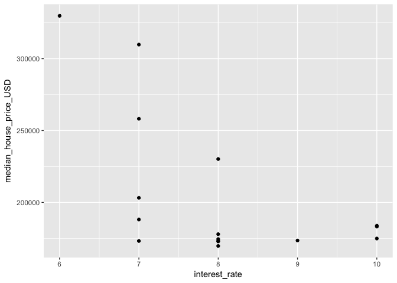

``` r
# Looks fairly linear and without outliers/influence points, so do linear
# regression
# Test assumes:
# - There is a linear trend between x and y.
# - The observations in the sample are independent.
# - x is measured without error.
# - The residuals are normally distributed.
# - The residuals have the same variance for all fitted values of y

# Analysis
##########
model <- lm(median_house_price_USD ~ interest_rate, data = data)
summary(model) # Hold off interpreting the model until you've done the diagnostics.
```

    ## 
    ## Call:
    ## lm(formula = median_house_price_USD ~ interest_rate, data = data)
    ## 
    ## Residuals:
    ##    Min     1Q Median     3Q    Max 
    ## -55865 -31631 -16406  27212  80735 
    ## 
    ## Coefficients:
    ##               Estimate Std. Error t value Pr(>|t|)    
    ## (Intercept)     399229      74427   5.364 9.99e-05 ***
    ## interest_rate   -24309       9205  -2.641   0.0194 *  
    ## ---
    ## Signif. codes:  0 '***' 0.001 '**' 0.01 '*' 0.05 '.' 0.1 ' ' 1
    ## 
    ## Residual standard error: 43180 on 14 degrees of freedom
    ## Multiple R-squared:  0.3325, Adjusted R-squared:  0.2848 
    ## F-statistic: 6.974 on 1 and 14 DF,  p-value: 0.01937

``` r
# Diagnostics
#############
# Base graphics QQ-plot (normality of residuals)
qqnorm(model$residuals)
qqline(model$residuals)  
```

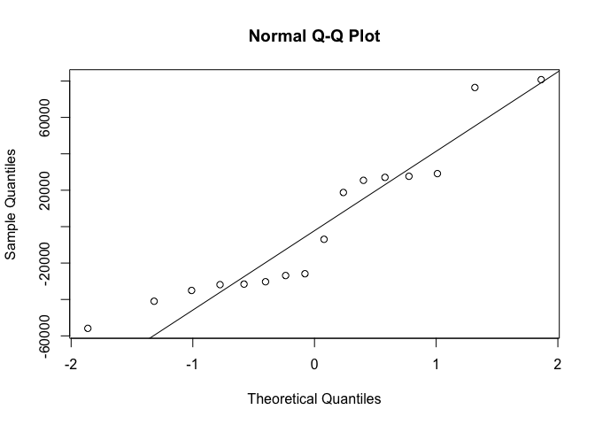

``` r
# Not pretty (but could be due to low sample size)

# fitted vs residual plot (homoskedasticity)
# Base graphics
plot(y = model$residuals, x = model$fitted)
abline(h = 0)
```

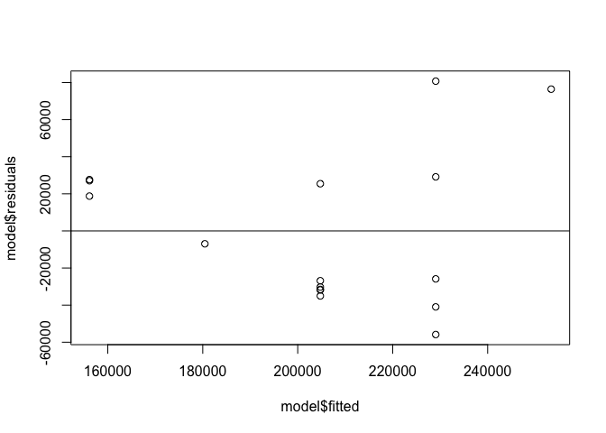

``` r
# ggplot
ggplot(data = model, aes(y = model$residuals, x = model$fitted)) +
    geom_point() +
    geom_hline(yintercept = 0)
```

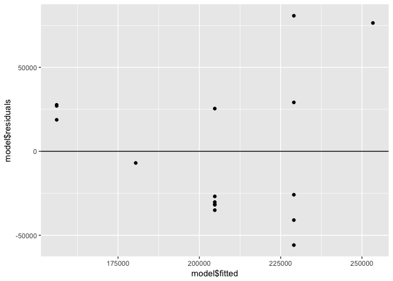

``` r
# Looks cone-shaped, which isn't good.

# An alternative way to get the diagnostic plots is:
par(mfcol = c(2, 2))
plot(model)
```

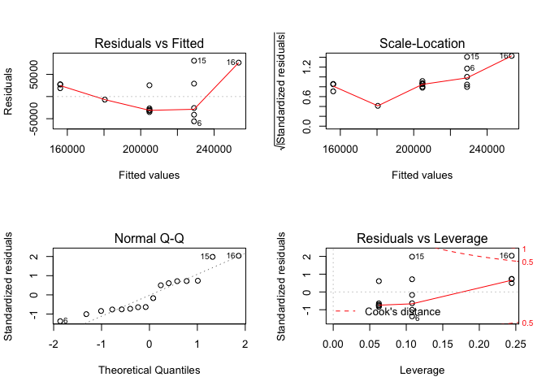

``` r
par(mfcol = c(1, 1))

# Failed diagnostics, so have to find a better model (e.g., transform the 
# data or use glm with an appropriate link function).
```

``` r
sessionInfo()
```

    ## R version 3.4.1 (2017-06-30)
    ## Platform: x86_64-apple-darwin15.6.0 (64-bit)
    ## Running under: macOS Sierra 10.12.6
    ## 
    ## Matrix products: default
    ## BLAS: /Library/Frameworks/R.framework/Versions/3.4/Resources/lib/libRblas.0.dylib
    ## LAPACK: /Library/Frameworks/R.framework/Versions/3.4/Resources/lib/libRlapack.dylib
    ## 
    ## locale:
    ## [1] en_GB.UTF-8/en_GB.UTF-8/en_GB.UTF-8/C/en_GB.UTF-8/en_GB.UTF-8
    ## 
    ## attached base packages:
    ## [1] grid      stats     graphics  grDevices utils     datasets  methods  
    ## [8] base     
    ## 
    ## other attached packages:
    ## [1] vcdExtra_0.7-0 gnm_1.0-8      vcd_1.4-3      bindrcpp_0.2  
    ## [5] readr_1.1.1    tidyr_0.6.3    dplyr_0.7.2    ggplot2_2.2.1 
    ## 
    ## loaded via a namespace (and not attached):
    ##  [1] Rcpp_0.12.12     ca_0.70          compiler_3.4.1   plyr_1.8.4      
    ##  [5] bindr_0.1        tools_3.4.1      digest_0.6.12    evaluate_0.10.1 
    ##  [9] tibble_1.3.3     gtable_0.2.0     lattice_0.20-35  pkgconfig_2.0.1 
    ## [13] rlang_0.1.1.9000 Matrix_1.2-10    curl_2.8.1       yaml_2.1.14     
    ## [17] relimp_1.0-5     stringr_1.2.0    knitr_1.16       qvcalc_0.9-0    
    ## [21] hms_0.3          nnet_7.3-12      rprojroot_1.2    lmtest_0.9-35   
    ## [25] glue_1.1.1       R6_2.2.2         rmarkdown_1.6    magrittr_1.5    
    ## [29] backports_1.1.0  scales_0.4.1     htmltools_0.3.6  MASS_7.3-47     
    ## [33] assertthat_0.2.0 colorspace_1.3-2 labeling_0.3     stringi_1.1.5   
    ## [37] lazyeval_0.2.0   munsell_0.4.3    zoo_1.8-0
